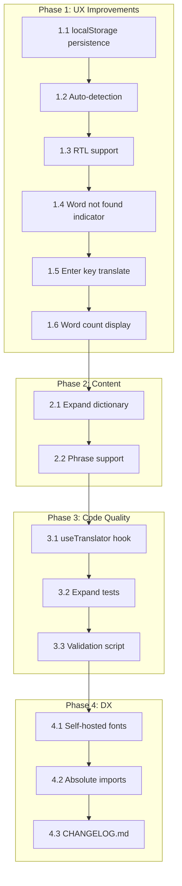

# Refactor Plan v2 — language-context-app

**Date:** March 3, 2026  
**Branch:** main  
**Stack:** React 19, Vite 6, JavaScript/JSX, Tailwind CSS v4.2, Vitest

---

## Overview

Building on the solid foundation of refactor-v1, v2 focuses on **UX improvements**, **content expansion**, **code quality**, and **developer experience**. This refactor adds persistence, RTL support, multi-word phrases, and sets the stage for TypeScript migration.

---

## Progress Tracker

| #   | Task                                  | Status     | Commit    |
| --- | ------------------------------------- | ---------- | --------- |
| 1.1 | localStorage persistence for language | ✅ Done    | `4c875b9` |
| 1.2 | Browser language auto-detection       | ✅ Done    | `4c875b9` |
| 1.3 | RTL layout support for Persian        | ✅ Done    | `4c875b9` |
| 1.4 | Word not found indicator              | ✅ Done    | `4c875b9` |
| 1.5 | Translate on Enter key                | ✅ Done    | `4c875b9` |
| 1.6 | Dictionary word count display         | ✅ Done    | `4c875b9` |
| 2.1 | Expand dictionary to 150+ words       | ✅ Done    | `4a87aca` |
| 2.2 | Multi-word phrase support             | ✅ Done    | `4a87aca` |
| 3.1 | Extract `useTranslator` hook          | ⬜ Pending | —         |
| 3.2 | Expand test coverage                  | ⬜ Pending | —         |
| 3.3 | Dictionary validation script          | ⬜ Pending | —         |
| 4.1 | Self-hosted fonts (fontsource)        | ⬜ Pending | —         |
| 4.2 | Absolute imports                      | ⬜ Pending | —         |
| 4.3 | CHANGELOG.md                          | ⬜ Pending | —         |

**Phase 1 Verification:**

- ✅ `npm run build` — clean build
- ✅ `npm test -- --run` — 9/9 tests pass
- ✅ `npm run lint` — zero errors

**Phase 2 Verification:**

- ✅ `npm run build` — clean build
- ✅ `npm test -- --run` — 11/11 tests pass
- ✅ Dictionary expanded: 60 → 134 words
- ✅ 10 multi-word phrases added
- ✅ `npm run lint` — zero errors

---

## Phase 1: UX Improvements

Priority: High | User-facing features that improve daily use

### 1.1 Persist language selection to localStorage

**Problem:** Refreshing the page resets language to English.

**Implementation:**

- Modify [`LanguageProvider.jsx`](src/contexts/LanguageProvider.jsx:5) to:
  - Read `localStorage.getItem('language')` on initial load (with `'EN'` fallback)
  - Save to `localStorage` on every `setLanguage` call using `useEffect`
- Key: `'language'`
- Files: [`src/contexts/LanguageProvider.jsx`](src/contexts/LanguageProvider.jsx)

**Testing:** Add test for localStorage persistence in `App.test.jsx`

---

### 1.2 Language auto-detection on first load

**Problem:** New users always start with English regardless of their browser settings.

**Implementation:**

- Read `navigator.language` (e.g., `"de-DE"`, `"fr"`)
- Map to closest supported code:
  - `"de"`, `"de-DE"`, `"de-AT"` → `"DE"`
  - `"tr"`, `"tr-TR"` → `"TR"`
  - `"fa"`, `"fa-IR"` → `"IR"`
  - `"fr"`, `"fr-FR"`, `"fr-CA"` → `"FR"`
  - `"es"`, `"es-ES"`, `"es-MX"` → `"SP"`
  - `"nl"`, `"nl-NL"` → `"DU"`
  - `"th"`, `"th-TH"` → `"TH"`
- Only apply if no `localStorage` value exists
- Files: [`src/contexts/LanguageProvider.jsx`](src/contexts/LanguageProvider.jsx)

---

### 1.3 RTL layout support for Persian (IR)

**Problem:** Persian is right-to-left but the layout stays LTR, causing readability issues.

**Implementation:**

- Add `dir` attribute to [`App.jsx`](src/App.jsx:9) wrapper based on language
- Create utility: `const isRTL = (code) => code === 'IR'`
- Apply `dir={isRTL(language) ? 'rtl' : 'ltr'}` to container div
- Use Tailwind `rtl:` variant for mirrored padding where needed:
  - Header: `rtl:space-x-reverse`
  - Translator buttons: `rtl:ml-2 rtl:mr-0`
- Files: [`src/App.jsx`](src/App.jsx), [`src/utils/languages.js`](src/utils/languages.js)

---

### 1.4 "Word not found" indicator in Translator

**Problem:** Unknown words pass through unchanged with no visual feedback.

**Implementation:**

- Track which words weren't found during translation
- Render unrecognized words with visual indicator:
  - Option A: Dotted underline + `[?]` badge
  - Option B: Different text color (e.g., `text-accent-coral`)
- Update [`Translator.jsx`](src/components/Translator.jsx:14) `handleTranslate` to return metadata:

  ```js
  const result = words.map((word) => {
    const translated = dictionary[word.toLowerCase()]?.[language];
    return {
      word: translated || word,
      found: !!translated,
    };
  });
  ```

- Files: [`src/components/Translator.jsx`](src/components/Translator.jsx)

---

### 1.5 Translate on Enter key

**Problem:** Users must click the Translate button; no keyboard shortcut.

**Implementation:**

- Add `onKeyDown` handler to input in [`Translator.jsx`](src/components/Translator.jsx:25)
- If `e.key === 'Enter'`, call `handleTranslate()`
- Prevent default form submission behavior
- Files: [`src/components/Translator.jsx`](src/components/Translator.jsx)

---

### 1.6 Dictionary word count display

**Problem:** Users don't know how many words are available.

**Implementation:**

- Compute `Object.keys(dictionary).length`
- Display small stat in Translator UI:

  ```jsx
  <span className="text-xs text-text-muted">
    {wordCount} words in dictionary
  </span>
  ```

- Files: [`src/components/Translator.jsx`](src/components/Translator.jsx)

---

## Phase 2: Content / Dictionary

Priority: Medium | Expanding app utility and translation accuracy

### 2.1 Expand dictionary to 150+ words

**Current:** ~60 words  
**Target:** 150+ words

**New categories to add:**

| Category     | Words to add                                                        |
| ------------ | ------------------------------------------------------------------- |
| Numbers      | one, two, three, four, five, six, seven, eight, nine, ten           |
| Colors       | red, blue, green, yellow, black, white, orange, purple, pink, brown |
| Body Parts   | head, hand, foot, eye, ear, nose, mouth, heart                      |
| Emotions     | angry, tired, scared, excited, bored, nervous, calm, surprised      |
| Transport    | car, bus, train, airplane, bike, boat, road, station                |
| Weather      | sunny, cloudy, rainy, snowy, windy, storm, temperature, season      |
| Animals      | dog, cat, bird, fish, horse, lion, bear, elephant                   |
| Common Nouns | book, phone, computer, door, window, chair, table, money            |

**File:** [`src/utils/dictionary.js`](src/utils/dictionary.js)

---

### 2.2 Multi-word phrase support

**Problem:** Phrases like "good morning" translate word-by-word as "Gut Morgen" instead of "Guten Morgen".

**Implementation:**

- Add `phrases` object in dictionary with space-separated keys:

  ```js
  const phrases = {
    "good morning": { EN: "Good morning", DE: "Guten Morgen", ... },
    "good night": { EN: "Good night", DE: "Gute Nacht", ... },
    "thank you very much": { EN: "Thank you very much", DE: "Vielen Dank", ... },
    "how are you": { EN: "How are you", DE: "Wie geht es dir", ... },
  };
  ```

- Update translation logic:
  1. Check for phrase match first (longest match priority)
  2. Fall back to word-by-word for unmatched tokens
- Files: [`src/utils/dictionary.js`](src/utils/dictionary.js), [`src/components/Translator.jsx`](src/components/Translator.jsx)

---

## Phase 3: Code Quality

Priority: Medium | Maintainability and test coverage

### 3.1 Extract `useTranslator` hook

**Problem:** Translation logic mixed with UI in [`Translator.jsx`](src/components/Translator.jsx).

**Implementation:**

- Create [`src/hooks/useTranslator.js`](src/hooks/useTranslator.js):

  ```js
  export function useTranslator() {
    const { language } = useLanguage();
    const [input, setInput] = useState("");
    const [result, setResult] = useState({ text: "", unknownWords: [] });

    const translate = useCallback(() => {
      // phrase-aware translation logic
    }, [input, language]);

    return { input, setInput, result, translate };
  }
  ```

- Update [`Translator.jsx`](src/components/Translator.jsx) to use the hook
- Makes translation logic independently testable

---

### 3.2 Expand test coverage

**Current:** 4 tests  
**Target:** ≥80% statement coverage

**New tests to add:**

| Test                           | Description                                           |
| ------------------------------ | ----------------------------------------------------- |
| `useLanguage` outside provider | Assert hook throws with clear error message           |
| localStorage persistence       | Assert language survives page reload                  |
| RTL detection                  | Assert `dir="rtl"` when Persian selected              |
| Unknown word indicator         | Assert unrecognized words get visual marker           |
| Phrase translation             | Assert "good morning" translates as phrase, not words |
| Dictionary integrity           | Assert every word has all 8 language keys             |
| `useTranslator` hook           | Unit test translation logic in isolation              |

**Install:** `@vitest/coverage-v8`
**Command:** `npm run test -- --coverage`

---

### 3.3 Add dictionary validation script

**Problem:** Easy to miss a translation when adding new words.

**Implementation:**

- Create `scripts/validate-dictionary.js`:
  - Assert all entries have exactly 8 language keys
  - Assert no empty values
  - Assert consistent casing
- Run in CI or as pre-commit hook

---

## Phase 4: Architecture / DX

Priority: Low | Nice-to-have improvements for developers

### 4.1 Self-hosted fonts (fontsource)

**Problem:** External Google Fonts dependency; privacy/load concerns.

**Implementation:**

```bash
npm install @fontsource/sora @fontsource/source-code-pro @fontsource/space-grotesk
```

- Import in [`src/main.jsx`](src/main.jsx):

  ```js
  import "@fontsource/sora/300.css";
  import "@fontsource/sora/400.css";
  import "@fontsource/sora/600.css";
  import "@fontsource/source-code-pro/400.css";
  import "@fontsource/space-grotesk/300.css";
  ```

- Remove Google Fonts `<link>` from [`index.html`](index.html:10)
- Files: [`src/main.jsx`](src/main.jsx), [`index.html`](index.html)

---

### 4.2 Absolute imports

**Problem:** Relative imports like `../../../hooks/useLanguage` are fragile.

**Implementation:**

- Update [`vite.config.js`](vite.config.js):

  ```js
  export default defineConfig({
    plugins: [react(), tailwindcss()],
    resolve: {
      alias: {
        "@": path.resolve(__dirname, "./src"),
      },
    },
    // ...
  });
  ```

- Create `jsconfig.json` or `tsconfig.json` for IDE support:

  ```json
  {
    "compilerOptions": {
      "baseUrl": ".",
      "paths": { "@/*": ["src/*"] }
    }
  }
  ```

- Gradually migrate imports: `../hooks/useLanguage` → `@/hooks/useLanguage`
- Files: [`vite.config.js`](vite.config.js)

---

### 4.3 Add CHANGELOG.md

**Format:** Keep a Changelog (Markdown)

```markdown
# Changelog

## [1.0.0] - 2026-03-03

### Added

- Refactor v1: React 19, Vite 6, Tailwind CSS v4.2
- 8-language support with normalized uppercase codes
- 60-word dictionary across 6 categories
- Vitest + Testing Library setup
- Custom useLanguage hook with provider guard

## [1.1.0] - TBD

### Added

- localStorage persistence for language selection
- Browser language auto-detection
- RTL support for Persian
- Unknown word indicator in Translator
- Phrase translation support
- Dictionary expanded to 150+ words
```

---

### 4.4 Component folder structure

**Current:** Flat `src/components/`  
**Proposed:** Feature-based organization

```
src/
├── components/
│   ├── ui/                    # Reusable UI primitives
│   │   ├── Button.jsx
│   │   └── Select.jsx
│   ├── layout/                # Layout components
│   │   ├── Header.jsx
│   │   └── Content.jsx
│   └── features/              # Feature-specific
│       ├── language/
│       │   ├── LanguageSelector.jsx
│       │   └── WelcomeMessage.jsx
│       └── translator/
│           ├── Translator.jsx
│           └── useTranslator.js
```

**Note:** Optional refactor; current flat structure is acceptable for project size.

---

## Implementation Order



**Recommended iteration:**

1. **Quick wins (Phase 1):** 1.1, 1.5, 1.6 — immediate user value
2. **Core features (Phase 2):** 2.1, 2.2 — expand app utility
3. **Stability (Phase 3):** 3.1, 3.2 — ensure reliability
4. **Polish (Phase 4):** 4.x — developer experience

---

## Verification Checklist

After completing v2, verify:

- [ ] `npm run dev` — app loads with last-selected language from localStorage
- [ ] `npm test -- --run` — all new tests pass
- [ ] `npm test -- --coverage` — ≥80% statement coverage
- [ ] `npm run lint` — zero ESLint errors
- [ ] `npm run build` — clean production build
- [ ] Persian (IR) language — layout renders RTL correctly
- [ ] Unknown word — visual indicator appears
- [ ] Phrase translation — "good morning" translates correctly
- [ ] Enter key — triggers translation
- [ ] Dictionary shows word count

---

## Migration to TypeScript (Future v3)

The v2 work prepares for TypeScript migration:

- Absolute imports (4.2) configured → easier path mapping
- `useTranslator` hook extracted → type-safe boundary
- Dictionary validation script → type-checking foundation

**v3 TypeScript targets:**

- Rename `.js/.jsx` → `.ts/.tsx`
- Type: `type LanguageCode = 'EN' | 'DE' | 'TR' | 'IR' | 'FR' | 'SP' | 'DU' | 'TH'`
- Type: `interface DictionaryEntry { EN: string; DE: string; ... }`
- Strict mode enabled
